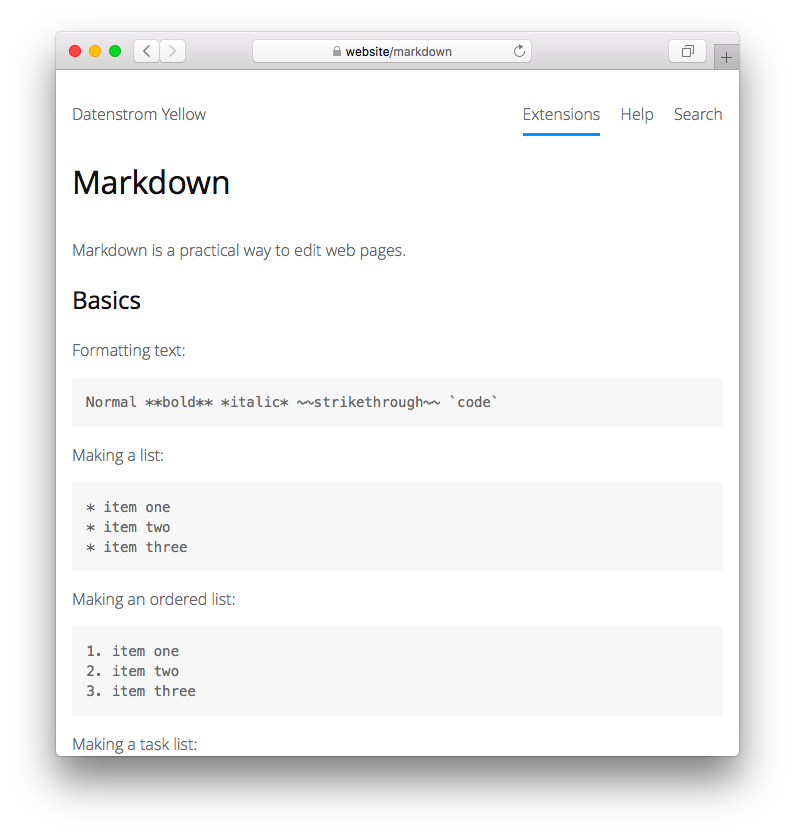

<p align="right"><a href="README-de.md">Deutsch</a> &nbsp; <a href="README.md">English</a> &nbsp; <a href="README-sv.md">Svenska</a></p>

# Markdown 0.9.3

Textformatering för människor.

<p align="center"></p>

## Hur man installerar ett tillägg

[Ladda ner ZIP-filen](https://github.com/annaesvensson/yellow-markdown/archive/refs/heads/main.zip) och kopiera den till din `system/extensions` mapp. [Läs mer om tillägg](https://github.com/annaesvensson/yellow-update/tree/main/README-sv.md).

## Hur man formaterar text

Markdown är ett praktiskt sätt att redigera webbsidor. Skriv text som i ett e-postmeddelande och det blir en webbsida. Efter en kort stund händer det naturligt utan att du ens tänker på det. Det övergripande designmålet för Markdown-syntaxen är att göra den så läsbar som möjligt. Här är [Markdown-syntaxen](http://commonmark.org/help/), [Markdown Extra funktioner](https://michelf.ca/projects/php-markdown/extra/) och [GitHub Flavored Markdown](https://help.github.com/en/articles/basic-writing-and-formatting-syntax).

Standard innehållsparsern definieras i filen `system/extensions/yellow-system.ini`. En annan innehållsparser kan definieras i [sidinställningarna](https://github.com/annaesvensson/yellow-core/tree/main/README-sv.md#inställningar-page) högst upp på varje sida, till exempel `Parser: markdown`.

## Hur man formaterar text med förkortningar

Markdown är ett flexibelt sätt att redigera webbsidor. Markdown-formaterad text kan öppnas med vilken textredigerare som helst. Eller så kan den redigeras i en [webbläsare](https://github.com/annaesvensson/yellow-edit/tree/main/README-de.md). De flesta applikationer stöder den grundläggande Markdown-syntaxen, vissa applikationer tillhandahåller förkortningar med ytterligare funktioner för webbsidor. Detta ger dig möjlighet att till exempel lägga till [bilder](https://github.com/annaesvensson/yellow-image/tree/main/README-sv.md) och [bildgallerier](https://github.com/annaesvensson/yellow-gallery/tree/main/README-sv.md). De tillgängliga förkortningar beror på installerade tillägg.

## Hur man formaterar text med blockelement

Markdown har stöd för blockelement som kan sträcka sig över flera rader. Sätt tecknet `>` i början av raden så kan du skapa ett citat. Eller sätt tecknet `!` i början av raden så kan du skapa ett allmänt blockelement. Om du är en webbutvecklare frågar du förmodligen, betyder det att jag kan lägga till `<div>...</div>` på en webbsida och var har du varit hela mitt liv? Svaret är ja och som en diamant i marken väntade den på att bli hittad.

## Exempel

Innehållsfil med namn på sidas och text:

    ---
    Title: Exempelsida
    ---
    Detta är en exempelsida.

    Lorem ipsum dolor sit amet, consectetur adipisicing elit, sed do eiusmod 
    tempor incididunt ut labore et dolore magna pizza. Ut enim ad minim veniam, 
    quis nostrud exercitation ullamco laboris nisi ut aliquip ex ea commodo. 

Formatera text:

    Normal **fet** *kursiv* ~~struken~~ `code`

Skapa en lista:

    * objekt ett
    * objekt två
    * objekt tre

Skapa en sorterad lista:

    1. objekt ett
    2. objekt två
    3. objekt tre

Skapa en uppgiftslista:

    - [x] objekt ett
    - [ ] objekt två
    - [ ] objekt tre

Skapa en rubrik:

    # Rubrik 1
    ## Rubrik 2
    ### Rubrik 3

Skapa länkar:

    [Länk till sidan](/help/how-to-make-a-small-website)
    [Länk till fil](/media/downloads/yellow-svenska.pdf)
    [Länk till webbplats](https://datenstrom.se/sv/)

Lägga till bilder:

    [image photo.jpg Exempel]
    [image photo.jpg "Detta är en exempelbild"]
    [image photo.jpg "Detta är en särskilt lång beskrivning"]

Skapa tabeller:

    | Kaffe      | Mjölk | Styrka  |
    |------------|-------|---------|
    | Espresso   | nej   | stark   |
    | Macchiato  | ja    | medium  |
    | Cappuccino | ja    | svag    |

Skapa fotnoter:

    Text med en fotnot[^1] och några fler fotnoter.[^2] [^3]
    
    [^1]: Här är den första fotnoten
    [^2]: Här är den andra fotnoten
    [^3]: Här är den tredje fotnoten

Visa källkod:

    ```
    Källkoden visas oförändrad.
    function onLoad($yellow) {
        $this->yellow = $yellow;
    }
    ```

Skapa paragraf:

    Här är första paragrafen. Text kan sträcka sig över flera rader
    och kan separeras med en tom rad från nästa paragrafen.

    Här är andra paragrafen. 

Skapa radbrytningar:

    Här är första raden⋅⋅
    Här är andra raden⋅⋅
    Här är tredje raden⋅⋅
    
    Mellanslag i slutet av raden representeras av prickar (⋅)

Skapa citat:

    > Citat
    
    >> Citat i citat
    
    >>> Citat i citat i citat

Skapa indikationer:

    ! Här är en indikation med varning 
    
    !! Här är en indikation med fel
    
    !!! Här är en indikation med tip

Använd CSS:

    ! {.class}
    ! Här är ett allmänt blockelement.
    ! Text kan sträcka sig över flera rader
    ! och innehåller Markdown-textformatering.

Använd HTML:

    <strong>Text med HTML</strong> kan valfritt användas.
    
    <a href="https://datenstrom.se" target="_blank">Öppna länken i en ny flik</a>.

Använd förkortningar med ytterligare funktioner:

    [image photo.jpg] = lägga till en bild eller miniatyrbild
    [gallery photo]   = lägga till ett bildgalleri med popup
    [slider photo]    = lägga till ett bildgalleri med reglaget

Tillägg för egen förkortning:

```
<?php
class YellowExample {
    const VERSION = "0.1.3";
    public $yellow;         // access to API
    
    // Handle initialisation
    public function onLoad($yellow) {
        $this->yellow = $yellow;
    }
    
    // Handle page content element
    public function onParseContentElement($page, $name, $text, $attributes, $type) {
        $output = null;
        if ($name=="example" && ($type=="block" || $type=="inline")) {
            $output = "<div class=\"".htmlspecialchars($name)."\">";
            $output .= "Add more HTML code here";
            $output .= "</div>";
        }
        return $output;
    }
}
```

## Tack

Detta tillägg innehåller [Markdown Extra 1.9.0](https://github.com/michelf/php-markdown) av Michel Fortin. Tack för ett bra jobb.

## Utvecklare

Anna Svensson. [Få hjälp](https://datenstrom.se/sv/yellow/help/).
