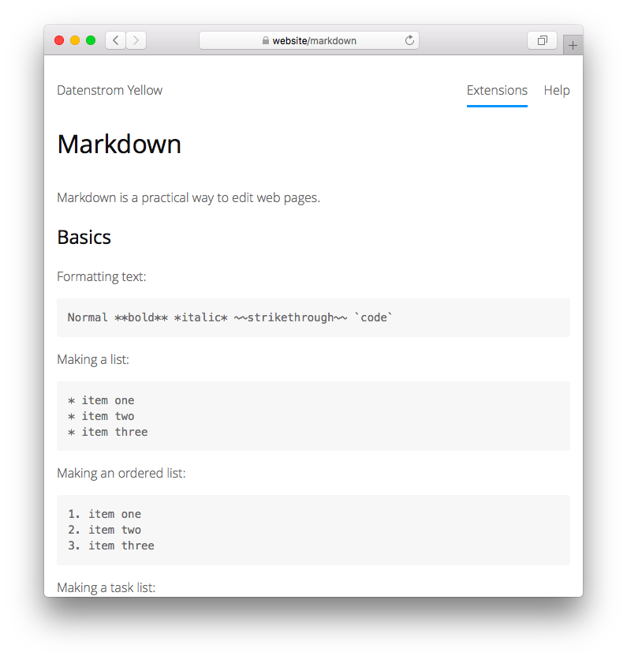

<p align="right"><a href="README-de.md">Deutsch</a> &nbsp; <a href="README.md">English</a> &nbsp; <a href="README-sv.md">Svenska</a></p>

# Markdown 0.9.4

Text formatting for humans.

<p align="center"></p>

## How to install an extension

[Download ZIP file](https://github.com/annaesvensson/yellow-markdown/archive/refs/heads/main.zip) and copy it into your `system/extensions` folder. [Learn more about extensions](https://github.com/annaesvensson/yellow-update).

## How to format text

Markdown is a practical way to edit web pages. Write text like you would in an email and it becomes a web page. After a short while, it happens naturally without you even thinking about it. The overriding design goal for the Markdown syntax is to make it as readable as possible. Here are the [Markdown syntax](http://commonmark.org/help/), [Markdown Extra features](https://michelf.ca/projects/php-markdown/extra/) and [GitHub Flavored Markdown](https://help.github.com/en/articles/basic-writing-and-formatting-syntax).

The default content parser is defined in file `system/extensions/yellow-system.ini`. A different content parser can be defined in the [page settings](https://github.com/annaesvensson/yellow-core#settings-page) at the top of each page, for example `Parser: markdown`.

## How to format text with shortcuts

Markdown is a quick way to edit web pages. Markdown-formatted text can be opened with any text editor. Or it can be edited in a [web browser](https://github.com/annaesvensson/yellow-edit). Most applications support the basic Markdown syntax, some applications provide shortcuts with additional features for web pages. This allows you, for example, to add [images](https://github.com/annaesvensson/yellow-image) and [image galleries](https://github.com/annaesvensson/yellow-gallery). Shortcuts are convenient for people who don't know HTML and CSS. The available shortcuts depend on extensions installed.

## How to format text with block elements

Markdown is a flexible way to edit web pages. Put the `!` character at the beginning of the line and you can make a general block element. This allows you, for example, to emphasise an entire paragraph in a special color. If you are a web developer you are probably asking, does this mean I can add `<div>...</div>` to a web page and where have you been all my life? The answer is yes and like a diamond in the ground it was waiting to be found. Block elements are convenient for people who know HTML and CSS. The available block elements depend on your current theme.

## Examples

Content file with page title and text:

    ---
    Title: Example page
    ---
    This is an example page.

    Lorem ipsum dolor sit amet, consectetur adipisicing elit, sed do eiusmod 
    tempor incididunt ut labore et dolore magna pizza. Ut enim ad minim veniam, 
    quis nostrud exercitation ullamco laboris nisi ut aliquip ex ea commodo. 

Formatting text:

    Normal **bold** *italic* ~~strikethrough~~ `code`

Making a list:

    * item one
    * item two
    * item three

Making an ordered list:

    1. item one
    2. item two
    3. item three

Making a task list:

    - [x] item one
    - [ ] item two
    - [ ] item three

Making a heading:

    # Heading 1
    ## Heading 2
    ### Heading 3

Making links:

    [Link to page](/help/how-to-make-a-small-website)
    [Link to file](/media/downloads/yellow-english.pdf)
    [Link to website](https://datenstrom.se)

Adding images:

    [image photo.jpg Example]
    [image photo.jpg "This is an example image"]
    [image photo.jpg "This is an especially long description"]

Making tables:

    | Coffee     | Milk | Strength |
    |------------|------|----------|
    | Espresso   | no   | strong   |
    | Macchiato  | yes  | medium   |
    | Cappuccino | yes  | weak     |

Making footnotes:

    Text with a footnote[^1] and some more footnotes.[^2] [^3]
    
    [^1]: Here's the first footnote
    [^2]: Here's the second footnote
    [^3]: Here's the third footnote

Showing source code:

    ```
    Source code will be shown unchanged.
    function onLoad($yellow) {
        $this->yellow = $yellow;
    }
    ```

Making paragraphs:

    Here's the first paragraph. Text can span over several lines
    and can be separated by a blank line from the next paragraph.

    Here's the second paragraph.

Making line breaks:

    Here's the first line⋅⋅
    Here's the second line⋅⋅
    Here's the third line⋅⋅
    
    Spaces at the end of the line are shown with dots (⋅)

Making quotes:

    > Quote
    
    >> Quote of a quote
    
    >>> Quote of a quote of a quote

Using shortcuts:

    [image photo.jpg] = adding an image or image thumbnail
    [gallery photo]   = adding an image gallery with popup
    [slider photo]    = adding an image gallery with slider

Using block elements:

    ! Here's a general block element.
    ! Text can span over several lines
    ! and contain Markdown text formatting.

    ! {.important}
    ! Here's information that needs attention.

    ! {.note}
    ! Hello, this text looks like a sticky note.

CSS for custom block element:

```
.content .example {
    margin: 1em 0;
    padding: 0.5em 1em;
    background-color: #f7f7f7;
    color: #333;
    border-radius: 3px;
}
```

Code for custom shortcut:

```
<?php
class YellowExample {
    const VERSION = "0.1.3";
    public $yellow;         // access to API
    
    // Handle initialisation
    public function onLoad($yellow) {
        $this->yellow = $yellow;
    }
    
    // Handle page content element
    public function onParseContentElement($page, $name, $text, $attributes, $type) {
        $output = null;
        if ($name=="example" && ($type=="block" || $type=="inline")) {
            $output = "<div class=\"".htmlspecialchars($name)."\">";
            $output .= "Add more HTML code here";
            $output .= "</div>";
        }
        return $output;
    }
}
```

## Acknowledgements

This extension includes [Markdown Extra 1.9.0](https://github.com/michelf/php-markdown) by Michel Fortin. Thank you for the good work.

## Developer

Anna Svensson. [Get help](https://datenstrom.se/yellow/help/).
